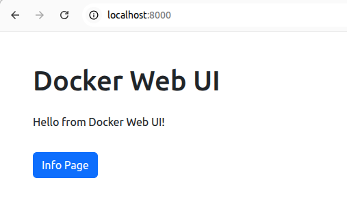

# Docker Web UI (Minimal)

This is a minimal Flask Web UI running inside Docker.

## How to run

docker build -t webui .
docker run -p 8000:8000 webui

Then open http://localhost:8000 in your browser.# docker-webui — Minimal Docker + Flask Web UI

This project is a **minimal Web UI running on Flask inside Docker**.  
It provides a simple structure for learning, prototyping, and extending small web applications.

---

## 🚀 Features

- Flask-based minimal web application  
- Docker containerized environment  
- Two-page UI using HTML templates  
- Bootstrap-based simple layout  
- Easy to extend for future development

---

## 📂 Directory Structure
```text
docker-webui/
├── Dockerfile
├── app.py
├── requirements.txt
├── templates/
│   ├── index.html
│   └── info.html
└── README.md
```

---

## 🖥️ How to Run

### 1. Build Docker image
docker build -t webui .


### 2. Run container

docker run -p 8000:8000 webui


### 3. Access in browser

- http://localhost:8000 
- http://localhost:8000/info 

---

## 📝 Pages

### `/`
Top page with a simple Bootstrap UI.

### `/info`
Technical overview page explaining the project, PIC method, and particle visualization.

---

## 📘 Info Page (Technical Overview)

The `/info` page provides a technical overview of this project and the
simulation context behind the visualization.

### 🔹 About This Project
This Web UI is a minimal Docker + Flask application with a built‑in
visualization pipeline. 
It is designed as a foundation for HPC and simulation workflows, and can be
extended to visualize electric fields, charge density, and phase‑space
evolution in future PIC simulations.

### 🔹 What is 1D Particle-In-Cell (PIC)?
PIC is a numerical method used to simulate plasma by tracking particles and
solving electric fields on a grid. 
Particles move according to the electric field, and their charge updates the
field again — forming a self‑consistent loop.

### 🔹 Sample Particle Distribution (particles.png)
The Info page includes a visualization of particle positions from a 1D PIC
simulation. 
Each dot represents a particle in configuration space. 
This plot is commonly used to verify:

- uniform particle loading 
- boundary conditions 
- early-time plasma behavior 

This project serves as a minimal but extensible base for future HPC
visualization pipelines.

----

## 🖼️ Screenshot



---

## 🛠️ Tech Stack

- Python 3.10 
- Flask 
- Bootstrap 5 
- Docker (python:3.10-slim base)

---

## 📄 License

MIT License

